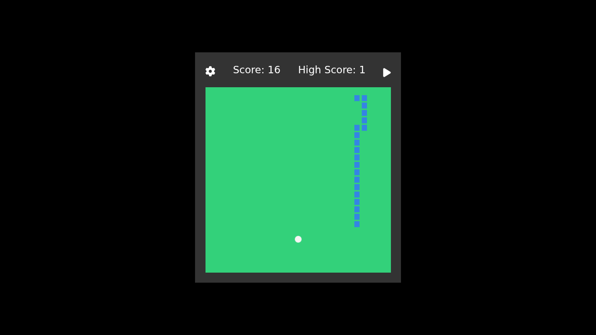

# 🐍 Snake Game

A classic Snake Game built using HTML, CSS, and JavaScript.
Play it right in your browser!

> 🔗 [Live Demo](https://vicky2805vky.github.io/snake-game/)

---

## 🎮 Screenshot



---

## 🚀 Features

- Move the snake using arrow keys
- Spacebar to pause/resume the game
- Custom settings for speed, board size, and snake growth
- High Score tracking (stored in localStorage)
- Sound effects for eating and game over
- Fully responsive design

---

## 🧑‍💻 How to Run Locally

1. Clone the repo:
   ```bash
   git clone https://github.com/vicky2805vky/snake-game.git
   ```
2. Open index.html in your browser

No build step needed. It runs directly in any modern browser.

## 🛠️ Technologies Used

- HTML5
- CSS3
- JavaScript (ES6 Modules)

## 📁 Project Structure

<pre>
     snake-game/
     ├── index.html
     ├── audio/
     │ └── gameMusic.mp3, eat.mp3, thud.mp3
     ├── javascripts/
     │ └── main.js, snake.js, gameboard.js, etc.
     ├── stylesheets/
     │ └── style.css
     ├── README.md
</pre>
